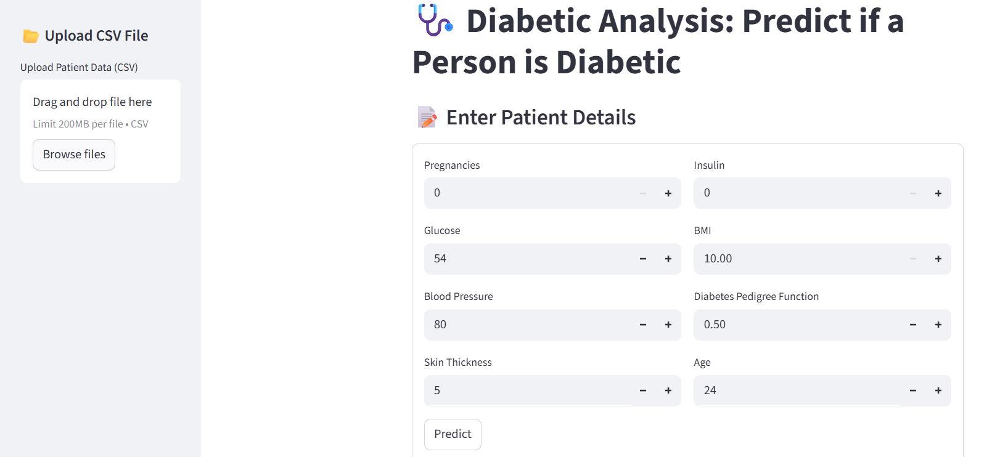
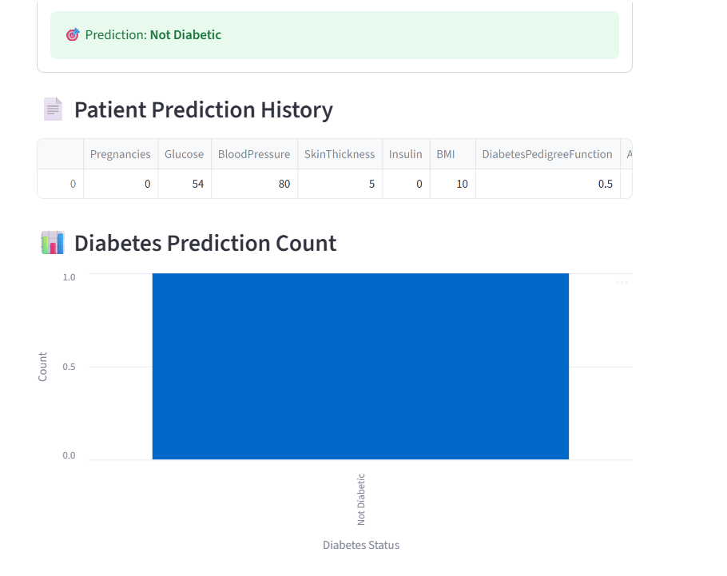

# DiabetesCare-AI 🩺🤖

A Streamlit web application that predicts whether a person is **Diabetic** or **Not Diabetic** based on medical input data.  
The app supports both **manual entry** and **CSV file upload** for batch predictions.

---

## 🚀 Features

- Upload patient data via **CSV file** for bulk predictions.
- Enter individual patient details manually using an input form.
- Prediction history stored during the session.
- Interactive **bar chart** showing prediction counts.
- Clean and user-friendly Streamlit interface.

---

## 📂 Project Structure

├── run.py # Main Streamlit application
├── diabetes.csv # Sample dataset
├── Diabetic.ipynb # Jupyter notebook (model training / analysis)
├── best_diabetes_model.pkl # Trained ML model (required to run app)

---

## ⚙️ Installation & Setup

1. **Clone the repository**

   ```bash
   git clone https://github.com/<your-username>/Diabetic-Analysis-App.git
   cd Diabetic-Analysis-App

   ```

2. **(Optional) Create a virtual environment**
   python -m venv venv
   venv\Scripts\activate # On Windows
   source venv/bin/activate # On Mac/Linux

3. **Install dependencies**
   pip install -r requirements.txt

4. **Run the Streamlit app**
   streamlit run run.py

5. Open the link provided in the terminal (default: http://localhost:8501).

📊 Input Data Format
CSV file must contain the following 8 required columns:
Pregnancies
Glucose
BloodPressure
SkinThickness
Insulin
BMI
DiabetesPedigreeFunction
Age

⚠️ Ensure the column names are exactly the same as above.
🛠️ Tech Stack
Python
Streamlit
Pandas
Scikit-learn
Joblib

📸 Screenshots


🤝 Contributing
Pull requests are welcome. For major changes, please open an issue first to discuss what you would like to change.

📄 License
This project is licensed under the MIT License.
